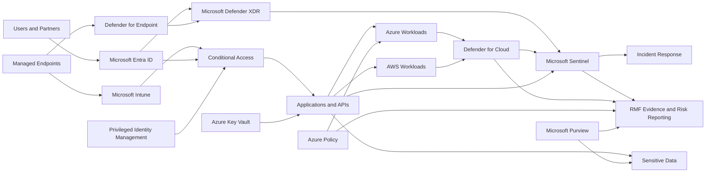

# Target Security Architecture

## Architecture Goal

Build a secure environment where access is checked continuously, sensitive data is protected, threats are detected centrally, and leaders receive measurable risk information.

## High-Level Architecture

## How the Design Protects the Organization

### 1. Identity

**What changes:** Users and administrators must prove who they are using strong authentication.

**Why it matters:** A stolen password alone should not allow access to sensitive systems.

**Key controls:**

- Multifactor authentication
- Conditional Access
- Separate administrator accounts
- Time-limited privileged access
- Quarterly access reviews

### 2. Endpoints

**What changes:** Sensitive applications require a managed and compliant endpoint.

**Why it matters:** A compromised or unmanaged device should not receive the same trust as a healthy corporate device.

**Key controls:**

- Endpoint inventory
- Device compliance
- Endpoint detection and response
- Disk encryption
- Patch and vulnerability management

### 3. Applications and Workloads

**What changes:** Applications use managed identities and protected secrets.

**Why it matters:** Long-lived credentials in code or deployment pipelines create avoidable risk.

**Key controls:**

- Managed identities
- Azure Key Vault
- Secure APIs
- Web application firewall
- Threat modeling and testing

### 4. Data

**What changes:** Sensitive information is identified, labeled, encrypted, and monitored.

**Why it matters:** Security should follow the data, even when the data moves.

**Key controls:**

- Data classification
- Sensitivity labels
- Encryption
- Data loss prevention
- Data-owner approval

### 5. Network and Cloud

**What changes:** Workloads are separated into smaller trust zones and cloud settings are continuously checked.

**Why it matters:** Segmentation limits how far an attacker can move.

**Key controls:**

- Network segmentation
- Private connectivity
- Firewall and web protection
- Azure Policy
- Defender for Cloud

### 6. Security Operations

**What changes:** Security alerts and logs are brought together for faster investigation.

**Why it matters:** Analysts need one coordinated view of identity, endpoint, cloud, application, and data activity.

**Key controls:**

- Microsoft Sentinel
- Defender XDR
- Automated enrichment
- Approved containment actions
- Incident records and lessons learned

## Responsibility Model

| Central Security and Platform Teams | Workload and Business Teams |
|---|---|
| Identity guardrails | Application access roles |
| Central monitoring | Application logs |
| Cloud policy baseline | Workload configuration |
| Shared network protection | Workload-specific network rules |
| Incident coordination | Workload recovery |
| Enterprise risk reporting | Data ownership and business impact |

## Architecture Outcome

The design does not depend on one security product. It combines people, process, technology, evidence, and leadership oversight.
