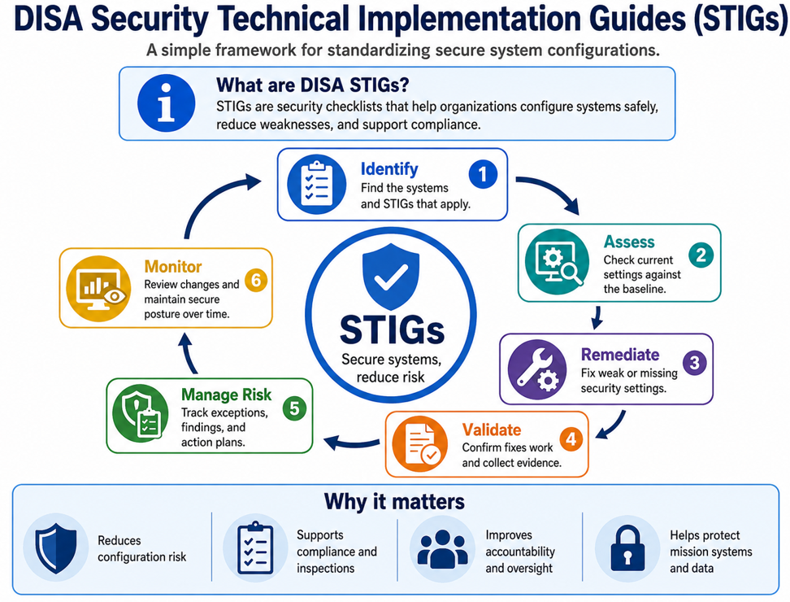

# DISA STIG Governance and Implementation

## Executive Overview

A Security Technical Implementation Guide, commonly called a **STIG**, is a secure-configuration standard used to reduce known weaknesses in operating systems, applications, databases, network devices, cloud services, and other technologies.

**Plain-language explanation:** A STIG is a detailed security checklist that explains how a technology should be configured before it is trusted to support the mission.

STIG implementation supports mission assurance, inspection readiness, consistent system hardening, and informed risk decisions. It does not replace the Risk Management Framework. Instead, STIG results provide technical evidence that supports RMF implementation, assessment, authorization, and continuous monitoring.

## Architecture Overview

*Figure 3. DISA STIG Implementation Lifecycle.*

DISA STIGs provide secure configuration requirements for systems and technologies. This lifecycle helps teams identify applicable requirements, assess settings, correct weaknesses, validate results, manage exceptions, and maintain compliance over time.

## Why STIGs Matter to Leadership

STIG compliance helps leaders answer five important questions:

1. Are mission systems configured securely?
2. Are serious weaknesses being corrected first?
3. Are exceptions documented and approved?
4. Can the organization demonstrate that required security settings are operating?
5. Is risk improving or getting worse over time?

## Relationship Between RMF and STIGs

| RMF Step | How STIGs Support the Step |
|---|---|
| Prepare | Identify applicable technologies, owners, security requirements, and assessment responsibilities |
| Categorize | Apply mission and information-impact decisions when prioritizing findings |
| Select | Use applicable STIG and Security Requirements Guide requirements to support control selection and tailoring |
| Implement | Configure systems according to approved hardening requirements |
| Assess | Review automated and manual checks, validate settings, and collect evidence |
| Authorize | Present unresolved findings, mitigations, and residual risk to leadership |
| Monitor | Reassess systems after changes, releases, updates, and scheduled review cycles |

## STIG Severity Categories

| Category | Plain-Language Meaning | Management Response |
|---|---|---|
| CAT I | A weakness that could cause immediate and serious harm | Prioritize for rapid correction or formal risk escalation |
| CAT II | A significant weakness that could lead to unauthorized access or reduced protection | Assign an owner and remediate within the approved risk-based schedule |
| CAT III | A lower-severity weakness that still reduces security or good configuration hygiene | Correct through normal maintenance and track to closure |

Severity is one input to the risk decision. Mission impact, exposure, exploitability, compensating controls, and operational constraints must also be considered.

## Step-by-Step STIG Process

### Step 1 — Identify Applicable STIGs

1. Inventory operating systems, applications, databases, network devices, cloud services, and security tools.
2. Identify the current approved STIG or Security Requirements Guide for each technology.
3. Record the STIG title, release, version, benchmark date, system owner, and technical owner.
4. Confirm which systems are in scope.

**Management outcome:** Every covered technology has a known security baseline and accountable owner.

### Step 2 — Establish the Baseline

1. Review each requirement for applicability.
2. Mark requirements as applicable or not applicable with documented justification.
3. Identify inherited settings and enterprise-wide configurations.
4. Approve implementation priorities based on mission risk.
5. Store the baseline in the approved evidence repository.

**Management outcome:** The organization knows which requirements apply and why.

### Step 3 — Assess the Current Configuration

1. Use approved automated assessment tools where supported.
2. Perform manual checks for requirements that cannot be automated.
3. Validate automated results to reduce false positives and false negatives.
4. Record the status of each requirement.
5. Preserve configuration evidence, screenshots, exports, commands, and reports.

Common assessment resources may include:

- STIG Viewer
- SCAP Compliance Checker or another approved SCAP-capable tool
- Enterprise configuration-management tools
- Cloud policy and posture-management tools
- Approved scripts and manual verification procedures

**Management outcome:** Leaders receive a defensible view of the current hardening posture.

### Step 4 — Remediate Findings

1. Correct the highest-risk findings first.
2. Test changes before broad deployment.
3. Use centralized configuration management where practical.
4. Confirm that remediation does not cause unacceptable mission impact.
5. Reassess corrected requirements.
6. Preserve before-and-after evidence.

**Management outcome:** High-risk weaknesses are reduced without creating avoidable operational disruption.

### Step 5 — Manage Exceptions and Residual Risk

A requirement that cannot be fully implemented must include:

- The affected requirement and asset
- Technical and business justification
- Mission or operational impact
- Risk rating
- Compensating controls
- Responsible owner
- Corrective-action plan
- Approval authority
- Review and expiration dates

Unresolved findings must be entered into the approved risk, Plan of Action and Milestones, or corrective-action process.

**Management outcome:** Unresolved weaknesses are visible, owned, time-bound, and formally reviewed.

### Step 6 — Validate and Report

1. Confirm the finding status through independent or authorized validation.
2. Reconcile automated and manual results.
3. Verify closure evidence.
4. Report open findings by severity, system, owner, age, and mission impact.
5. Escalate overdue high-risk findings.

**Management outcome:** Reported compliance is supported by evidence rather than self-attestation alone.

### Step 7 — Continuously Monitor

Reassess STIG posture:

- After major configuration changes
- After operating-system or application upgrades
- After new STIG releases
- After major incidents
- Before authorization decisions
- According to the approved continuous-monitoring schedule

**Management outcome:** Secure configurations remain effective as technology and threats change.

## Responsibility Model

| Role | STIG Responsibility |
|---|---|
| Executive Sponsor | Supports resources, priorities, and major risk decisions |
| System Owner | Owns mission impact and residual system risk |
| ISSM or GRC Lead | Coordinates governance, evidence, findings, and reporting |
| ISSO or Security Analyst | Tracks compliance status and validates documentation |
| System or Network Administrator | Implements approved configuration changes |
| Application or Platform Owner | Resolves product-specific findings |
| Assessor | Evaluates requirement status and supporting evidence |
| SOC and Vulnerability Teams | Provide threat, incident, and vulnerability context |
| Authorizing Official or Risk Authority | Reviews and decides whether remaining risk is acceptable |

## Executive Dashboard

Leadership reporting should include:

| Metric | Desired Direction |
|---|---|
| Assets with an assigned STIG baseline | Increase to 100% |
| Assessed in-scope assets | Increase to 100% |
| Open CAT I findings | Decrease to 0 |
| Open CAT II findings | Decrease |
| Open CAT III findings | Decrease through planned maintenance |
| Overdue high-risk findings | Decrease to 0 |
| Findings without an owner | Decrease to 0 |
| Expired exceptions | Decrease to 0 |
| Findings reopened after validation | Decrease |
| Compliance trend by system | Improve over time |

## Example Management Summary

> The organization assessed all in-scope mission systems against their approved STIG baselines. Critical findings were prioritized for immediate remediation. Remaining findings have assigned owners, corrective-action dates, documented compensating controls, and risk-review requirements. Leadership receives monthly trend reporting and is notified when a high-risk finding becomes overdue or an exception approaches expiration.

## STIGs and Vulnerability Scanning

STIG assessment and vulnerability scanning are related but different:

- **STIG assessment** checks whether a system is securely configured.
- **Vulnerability scanning** identifies known software weaknesses, missing patches, and exposed services.

A mature program uses both. A patched system can still be insecurely configured, and a well-configured system can still contain vulnerable software.

## Definition of Done

A system is considered ready for STIG reporting when:

1. The correct baseline and version are recorded.
2. All applicable requirements have been assessed.
3. Automated results have been validated.
4. Manual checks include supporting evidence.
5. High-risk findings have been corrected or formally escalated.
6. Remaining findings have owners and target dates.
7. Exceptions include compensating controls and expiration dates.
8. Results are stored in the approved evidence repository.
9. The system is included in continuous monitoring.

## Leadership Takeaway

STIGs convert broad security expectations into specific technical settings. Effective governance ensures those settings are applied consistently, assessed honestly, tied to mission risk, and continuously monitored.

## Important Note

Actual implementation must use the current approved DISA STIG or Security Requirements Guide package, organizational policy, system-specific requirements, and the applicable authorization authority's direction. This portfolio file is an educational governance model and is not an official compliance determination.
