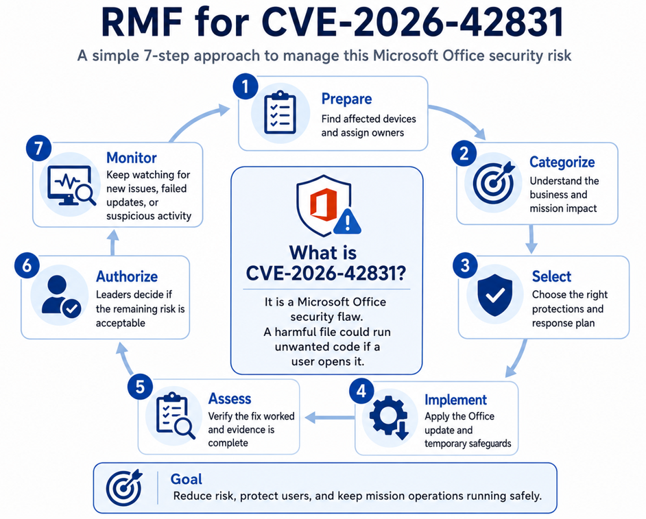

# CVE-2026-42831 — Microsoft Office RCE RMF Risk-Mitigation Case Study

## Purpose

This project shows how a Risk Management Framework (RMF) specialist would manage a Microsoft Office security weakness. It follows the work from discovery and risk review through remediation, leadership approval of any remaining risk, and continued monitoring.

## Architecture Overview



*Figure 1. RMF provides a seven-step process for identifying affected systems, applying safeguards, validating remediation, approving remaining risk, and continuously monitoring CVE-2026-42831.*

## What Is CVE-2026-42831?

CVE-2026-42831 is a Microsoft Office security flaw. An attacker could send a harmful Office file and try to convince a user to open it. If successful, the file could run unwanted code, access information, change files, or disrupt the device.

## Vulnerability Summary

| Item | Plain-language detail |
|---|---|
| CVE | CVE-2026-42831 |
| Product | Microsoft Office |
| Vulnerability type | Heap-based buffer overflow, which is a memory-handling error |
| Possible impact | Remote Code Execution or local code execution, meaning an attacker may run unwanted commands after the user opens the file |
| Microsoft severity | Critical |
| CVSS v3.1 score | 7.8 High |
| Attack vector | Local; the harmful file must be opened on the device |
| Privileges required | None; the attacker does not need an existing account or permissions |
| User interaction | Required; the user must open the harmful Office file |
| Likely scenario | An attacker convinces a user to open a harmful Office file |
| Preview Pane | The Preview Pane alone does not trigger this vulnerability, according to Microsoft |
| Publicly disclosed at publication | No |
| Exploited at publication | No |
| Initial exploitability assessment | Exploitation Unlikely |
| Official fix | Microsoft has made an official vendor fix available |

### Affected Versions Identified in the Published Record

- Microsoft Office LTSC for Mac 2021 earlier than build **16.109.26051019**
- Microsoft Office LTSC for Mac 2024 earlier than build **16.109.26051019**
- Microsoft Office for Android earlier than build **16.0.19822.20190**

Always confirm the current Microsoft advisory before deployment because affected-product information and exploitation status can change.

## Organizational Risk Statement

An attacker could send a harmful Office file to someone using an affected version of Microsoft Office. If the user opens it, the attacker may be able to run unwanted code with that user's access. The greatest concern is the possible effect on sensitive information, the reliability of systems and data, and the organization's ability to carry out mission operations.

## Risk Decision

- **Initial organizational risk: High.** The flaw could affect sensitive information, system reliability, or mission operations.
- **Critical priority:** Treat affected devices as the highest priority when they are used by privileged users or support mission-essential work.
- **Main action:** Install the official Microsoft update and confirm that the correct version is installed.
- **Temporary residual risk: Medium.** Use temporary safeguards when the update cannot be installed immediately.
- **Target residual risk: Low.** Reach this level after remediation is verified, evidence is complete, and monitoring continues.
- **Leadership approval:** Leadership must decide whether any remaining risk is acceptable.

Microsoft's severity rating and the organization's risk level are related but are not the same. The organization must also consider the importance of each device, the sensitivity of its data, user access, existing safeguards, and operational needs.

## How RMF Is Applied

1. **Prepare** — Identify affected devices, systems, and responsible owners.
2. **Categorize** — Determine the possible business and mission impact.
3. **Select** — Choose the update, safeguards, monitoring, and response actions.
4. **Implement** — Apply the update and temporary protections.
5. **Assess** — Verify the update worked and the evidence is complete.
6. **Authorize** — Leadership decides whether the remaining risk is acceptable.
7. **Monitor** — Continue checking for failed updates, new affected devices, and suspicious activity.

## Recommended Risk-Mitigation Actions

- Identify affected Microsoft Office versions.
- Prioritize privileged and mission-critical devices.
- Apply the official Microsoft update.
- Restrict or isolate systems that cannot be updated immediately.
- Strengthen email filtering and attachment scanning.
- Increase endpoint and security monitoring.
- Track unresolved findings through a Plan of Action and Milestones (POA&M).
- Update Enterprise Mission Assurance Support Service (eMASS) records and RMF evidence.
- Verify remediation before closing the finding.

## Repository Contents

```text
CVE-2026-42831-office-rce-rmf/
├── README.md
├── 01-executive-risk-brief.md
├── 02-rmf-step-by-step-guide.md
├── 03-nist-800-53-control-mapping.md
├── 04-mitigation-and-validation-plan.md
├── 05-poam-management-guide.md
├── 06-continuous-monitoring-plan.md
├── 07-incident-response-playbook.md
├── 08-leadership-dashboard.md
├── 09-lessons-learned.md
├── risk-register.csv
├── poam-register.csv
├── evidence-register.csv
└── architecture/
    ├── cve-rmf-response-flow.mmd
    └── rmf-for-cve-2026-42831.png
```

## Recommended Review Order

1. Executive Risk Brief
2. RMF Step-by-Step Guide
3. Control Mapping
4. Mitigation and Validation Plan
5. POA&M Guide
6. Continuous Monitoring Plan
7. Incident Response Playbook
8. Leadership Dashboard
9. Lessons Learned

## Skills Demonstrated

- RMF lifecycle and cybersecurity governance
- Risk assessment and leadership communication
- NIST SP 800-53 control mapping
- POA&M tracking and eMASS documentation
- Vulnerability remediation and update governance
- Continuous monitoring and incident-response coordination
- Microsoft endpoint and application security
- Clear technical and executive documentation

## References

- [Microsoft Security Response Center — CVE-2026-42831](https://msrc.microsoft.com/update-guide/vulnerability/CVE-2026-42831)
- [NIST National Vulnerability Database — CVE-2026-42831](https://nvd.nist.gov/vuln/detail/CVE-2026-42831)
- [NIST SP 800-37 Rev. 2 — Risk Management Framework](https://csrc.nist.gov/pubs/sp/800/37/r2/final)
- [NIST SP 800-53 Rev. 5 — Security and Privacy Controls](https://csrc.nist.gov/pubs/sp/800/53/r5/upd1/final)
- [NIST SP 800-53A Rev. 5 — Control Assessment Procedures](https://csrc.nist.gov/pubs/sp/800/53/a/r5/final)
- [DoDI 8510.01 — Risk Management Framework for DoD Systems](https://www.esd.whs.mil/Directives/issuances/dodi/)
- [Microsoft — Deploy updates for Office for Mac](https://learn.microsoft.com/en-us/microsoft-365-apps/mac/deploy-updates-for-office-for-mac)
- [Microsoft — Update Office for Mac automatically](https://support.microsoft.com/en-us/office/lifecycle/officeinstall/update-office-for-mac-automatically)
- [Microsoft Intune — Managed Google Play applications](https://learn.microsoft.com/en-us/intune/app-management/deployment/add-managed-google-play)
- [Microsoft Defender for Endpoint — Software inventory](https://learn.microsoft.com/en-us/defender-endpoint/api/get-software)

> **Important:** This case study is for education only. Do not use it as an official authorization package or as a substitute for a production security response. Any real response must follow the current vendor advisory, organizational policy, applicable authorization guidance, approved change procedures, and the system's actual architecture.
