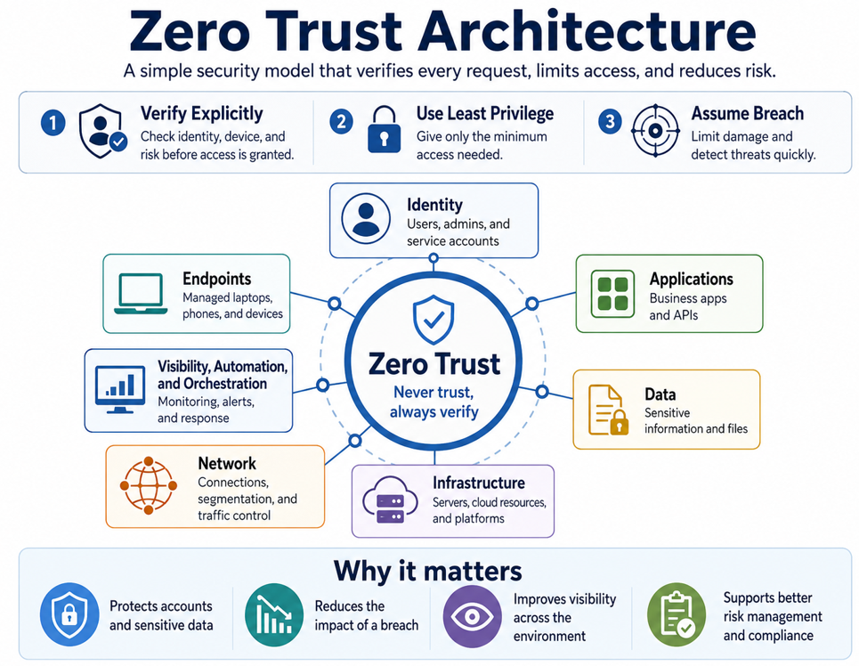

# Zero Trust Governance Policy

## Purpose

Establish clear, organization-wide expectations for secure access, data protection, monitoring, accountability, and risk management.

## Architecture Overview

*Figure 1. Zero Trust Architecture.*

Zero Trust continuously verifies users, devices, applications, and access requests. This approach limits unnecessary access, protects sensitive information, and reduces the impact of a compromised account or endpoint.

## Policy Principles

### Verify Every Access Request

Access is not approved only because a user or device is inside the network. The organization checks identity, device health, location, risk, application sensitivity, and data sensitivity.

### Limit Access

Users, administrators, partners, and applications receive only the access needed for an approved purpose and time.

### Assume an Attack Can Occur

Systems are segmented, activity is monitored, and incident-response procedures are maintained so that one compromised account or device does not cause widespread damage.

## Mandatory Requirements

### Identity and Privileged Access

- Strong multifactor authentication is required for privileged, remote, and sensitive access.
- Administrators use separate standard and privileged accounts.
- Permanent privileged access is minimized.
- High-impact roles require approval and time-limited activation.
- Access is reviewed quarterly.

### Endpoints

- Sensitive access requires a managed and compliant endpoint unless an exception is approved.
- Corporate endpoints use approved endpoint protection and disk encryption.
- Critical security updates follow risk-based deadlines.
- Noncompliant endpoints receive restricted access.

### Applications and Cloud

- Applications use managed identities where practical.
- Secrets and certificates are stored in approved secret-management services.
- Public exposure requires documented business justification.
- Required cloud policies and diagnostic logs are enabled.
- High-risk cloud findings are tracked to closure.

### Data

- Data is classified and assigned an owner.
- Confidential and Regulated data is encrypted.
- Access reflects business need and data sensitivity.
- High-risk data movement is monitored.
- Retention and disposal follow approved requirements.

### Monitoring and Incident Response

- Critical logs are centralized.
- High-severity alerts have defined owners and escalation paths.
- Incident records preserve evidence, actions, decisions, and lessons learned.
- Monitoring gaps are recorded as risks.

## Roles

| Role | Accountability |
|---|---|
| Executive Sponsor | Approves priorities and major risk decisions |
| System Owner | Owns mission impact and system risk |
| Security Architect | Designs the security approach |
| GRC Lead | Coordinates RMF, evidence, and reporting |
| Control Owners | Implement and operate assigned controls |
| SOC Lead | Monitors, investigates, and responds |
| Data Owners | Approve classification, access, and retention |
| Workload Owners | Secure applications and remediate findings |

## Exceptions

Every exception must include:

- Business justification
- Affected systems and data
- Risk level
- Compensating controls
- Named owner
- Approval
- Expiration date

Expired exceptions are invalid and must be closed, renewed, or escalated.

## Review

This policy is reviewed annually and after major incidents, major system changes, or significant changes in risk.
