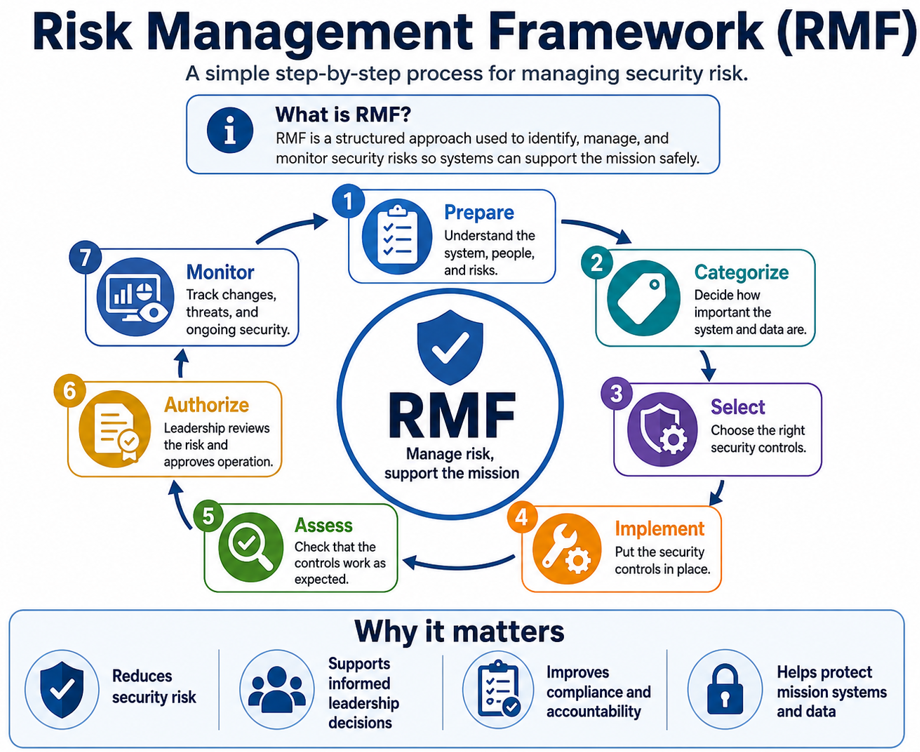

# RMF for Leaders and Stakeholders

## What Is RMF?

RMF is a seven-step decision process for managing cybersecurity risk.

It helps leaders answer four questions:

1. What are we protecting?
2. What could go wrong?
3. Are our protections working?
4. Is the remaining risk acceptable?

## Architecture Overview

*Figure 2. Risk Management Framework Lifecycle.*

RMF provides a repeatable seven-step process for identifying risk, selecting protections, validating that controls work, and supporting leadership authorization decisions. Continuous monitoring keeps the risk decision current as systems and threats change.

## Step 1 — Prepare

**Business question:** What is the mission, what is in scope, and who is responsible?

**Key activities:**

- Define the system boundary.
- Identify users, applications, data, cloud resources, and dependencies.
- Assign owners.
- Record major threats and weaknesses.

**Leadership role:** Confirm scope, ownership, and risk priorities.

**Primary output:** Project scope, stakeholder roles, architecture, and initial risk register.

## Step 2 — Categorize

**Business question:** How serious would the impact be if information were exposed, changed, or unavailable?

**Key activities:**

- Identify information types.
- Evaluate confidentiality, integrity, and availability.
- Document the business impact.

**Leadership role:** Approve the impact level and business rationale.

**Primary output:** Approved security-impact decision.

## Step 3 — Select

**Business question:** Which protections are appropriate for the level of risk?

**Key activities:**

- Choose security controls.
- Tailor them to the mission and environment.
- Identify shared and inherited controls.
- Assign control owners.

**Leadership role:** Confirm priorities, resources, and acceptable tradeoffs.

**Primary output:** Approved control set and implementation plan.

## Step 4 — Implement

**Business question:** Have the selected protections been put into operation?

**Key activities:**

- Configure technical controls.
- Publish procedures.
- Train responsible teams.
- Define evidence and monitoring.

**Leadership role:** Remove implementation barriers and enforce accountability.

**Primary output:** Working controls with documented ownership and evidence.

## Step 5 — Assess

**Business question:** Are the protections working as expected?

**Key activities:**

- Review documents and configurations.
- Interview responsible personnel.
- Test approved and prohibited scenarios.
- Record weaknesses.

**Leadership role:** Ensure assessments are independent, honest, and risk based.

**Primary output:** Assessment results and corrective actions.

## Step 6 — Authorize

**Business question:** Is the remaining risk acceptable for the mission?

**Key activities:**

- Review open findings.
- Review compensating controls.
- Review mission impact.
- Review remediation plans.
- Decide whether the system can operate.

**Leadership role:** Accept, reject, or conditionally accept the remaining risk.

**Primary output:** Documented risk decision.

## Step 7 — Monitor

**Business question:** Is risk changing, and are controls still effective?

**Key activities:**

- Monitor threats, vulnerabilities, and incidents.
- Track policy compliance.
- Review privileged access.
- Review exceptions.
- Update risk after major changes.

**Leadership role:** Review trends and ensure overdue high-risk actions are resolved.

**Primary output:** Ongoing risk reporting and continuous improvement.

## Control Mapping Snapshot

| Business Need | Example NIST Control Areas |
|---|---|
| Manage user and administrator access | Access Control and Identification and Authentication |
| Detect suspicious activity | Audit and Accountability and System and Information Integrity |
| Respond to incidents | Incident Response |
| Manage vulnerabilities | Risk Assessment and System and Information Integrity |
| Protect communications and stored data | System and Communications Protection |
| Continuously review security | Assessment, Authorization, and Monitoring |

## Leadership Takeaway

RMF is not paperwork for its own sake. It creates a repeatable way to connect mission needs, security controls, evidence, and leadership risk decisions.
